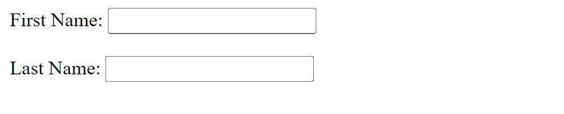
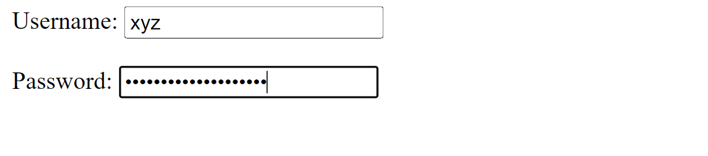
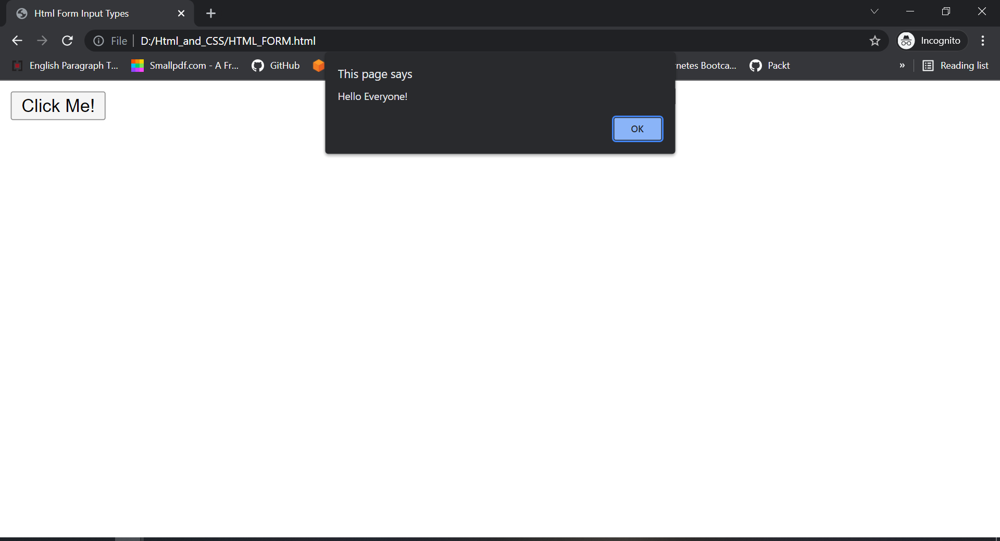
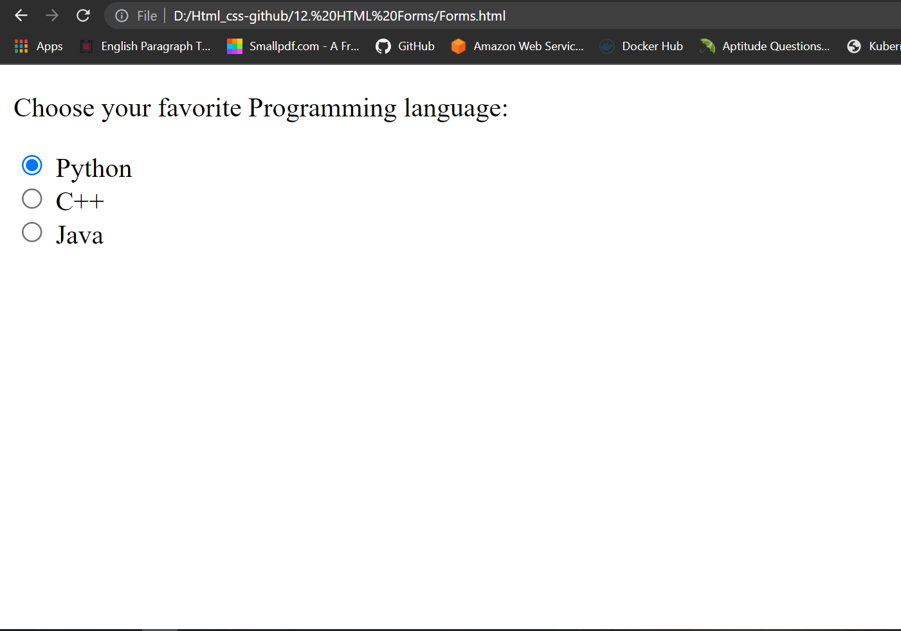
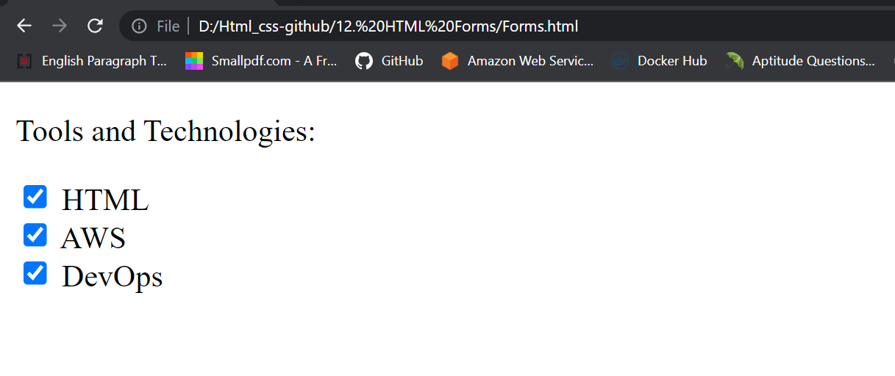
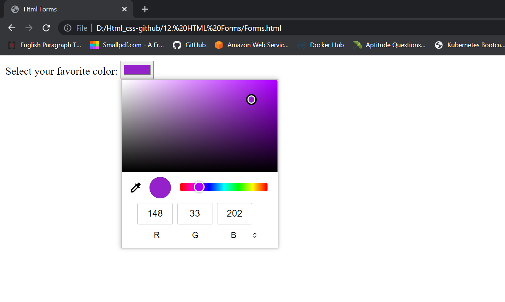
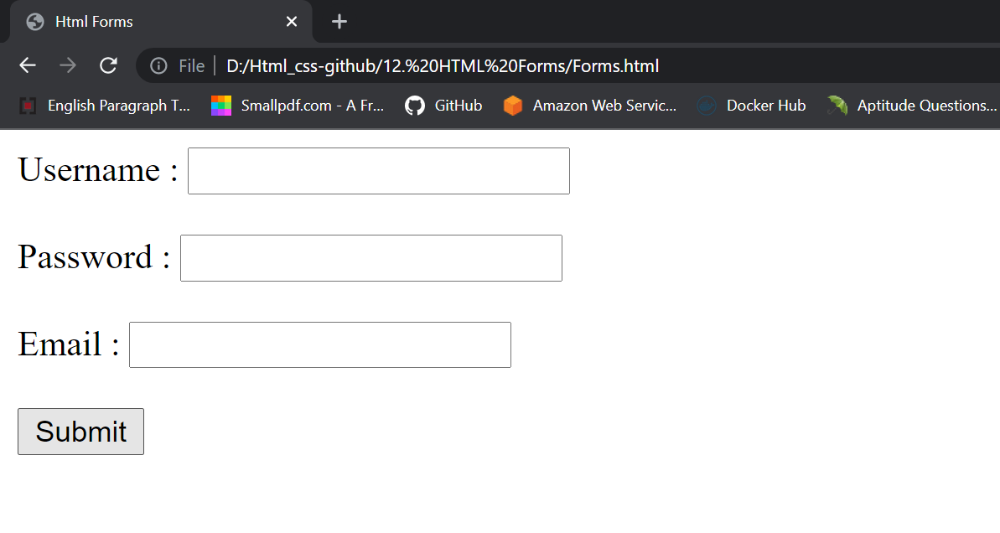
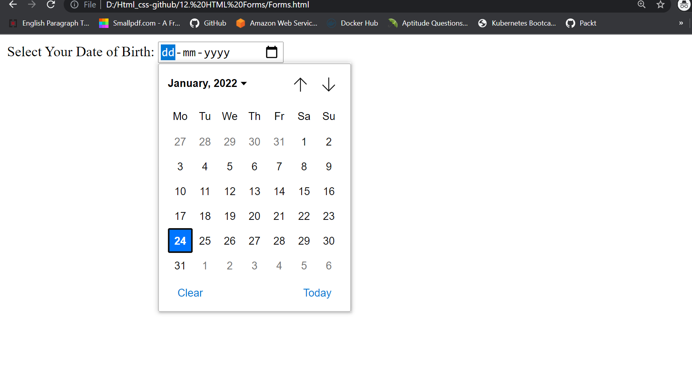
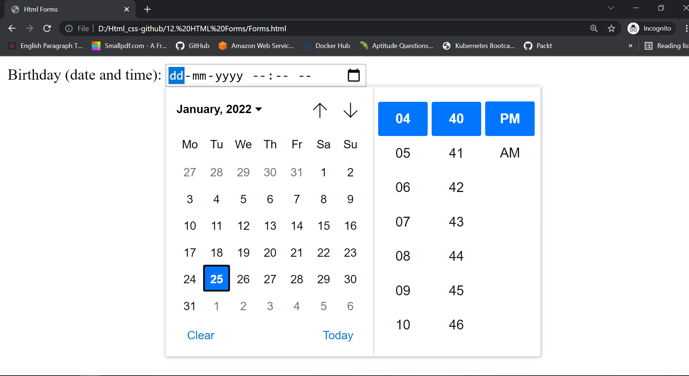
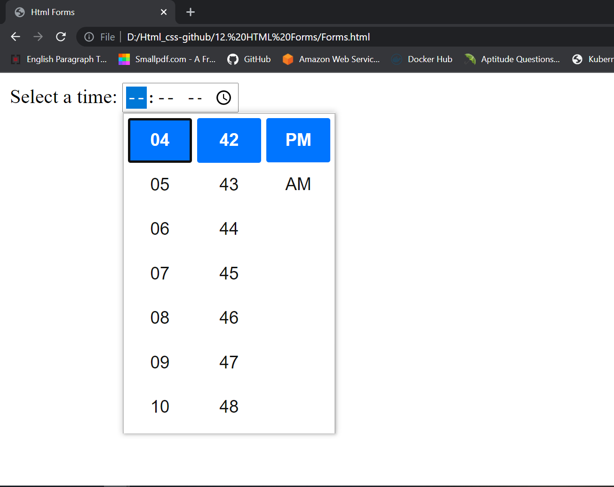

# HTML Input Types
Here are the different input types we can use in HTML: <br>
- `<input type="text">`
- `<input type="email">`
- `<input type="password">`
- `<input type="button">`
- `<input type="radio">`
- `<input type="checkbox">`
- `<input type="color">`
- `<input type="file">`
- `<input type="submit">`
- `<input type="date">`
- `<Input Type Datetime-local>`
- `<input type="time">`

## Input Type - Text
`<input type="text">` defines a single-line text input field. <br>
### Example
```
<form>
     <label for="firstname">First Name:</label>
     <input type="text" id="firstname" name="firstname"> <br><br>
     <label for="lastname">Last Name:</label>
     <input type="text" id="lastname" name="lastname">
</form>
```

### Output
This is how the HTML code above will be displayed in a browser: <br>



## Input Type - Email
The `<input type="email">` is used for input fields that should contain an e-mail address. <br>

### Example
```
<form>
  <label for="email">Enter your email:</label>
  <input type="email" id="email" name="email">
</form>
```

### Output
This is how the HTML code above will be displayed in a browser: <br>


## Input Type - Password
`<input type="password">` defines a password field. <br>

### Example
```
<form>
      <label for="username">Username:</label>
      <input type="text" id="username" name="username"> <br><br>
      <label for="passwd">Password:</label>
      <input type="password" id="passwd" name="passwd">
</form>
```

### Output
This is how the HTML code above will be displayed in a browser: <br>



## Input Type - Button
`<input type="button">` defines a button.<br>

### Example
```
<input type="button" onclick="alert('Hello Everyone!')" value="Click Me!">
```

### Output
This is how the HTML code above will be displayed in a browser: <br>



## Input Type - Radio
`<input type="radio">` defines a radio button. <br>
Radio buttons let a user select ONLY ONE of a limited number of choices. <br>

### Example
```
<!DOCTYPE html>
<html lang="en">
<head>
    <meta charset="UTF-8">
    <meta http-equiv="X-UA-Compatible" content="IE=edge">
    <meta name="viewport" content="width=device-width, initial-scale=1.0">
    <title>Html Forms</title>
</head>
<body>
    <p>Choose your favorite Programming language:</p>
    <form>
        <input type="radio" id="python" name="fav_language" value="Python">
        <label for="python">Python</label><br>
        <input type="radio" id="c++" name="fav_language" value="C++">
        <label for="c++">C++</label><br>
        <input type="radio" id="java" name="fav_language" value="Java">
        <label for="java">Java</label>
      </form>
</body>
</html>
```

### Output
This is how the HTML code above will be displayed in a browser: <br>



## Input Type - Checkbox
`<input type="checkbox">` defines a checkbox. <br>
Checkboxes let a user select ZERO or MORE options of a limited number of choices. <br>

### Example
```
<!DOCTYPE html>
<html lang="en">
<head>
    <meta charset="UTF-8">
    <meta http-equiv="X-UA-Compatible" content="IE=edge">
    <meta name="viewport" content="width=device-width, initial-scale=1.0">
    <title>Html Forms</title>
</head>
<body>
    <p>Tools and Technologies:</p>
    <form>
        <input type="checkbox" id="html" name="tools_and_technologies" value="HTML">
        <label for="html">HTML</label><br>
        <input type="checkbox" id="aws" name="tools_and_technologies" value="AWS">
        <label for="aws">AWS</label><br>
        <input type="checkbox" id="devops" name="tools_and_technologies" value="DevOps">
        <label for="devops">DevOps</label>
      </form>
</body>
</html>
```

### Output
This is how the HTML code above will be displayed in a browser: <br>



## Input Type - Color
The `<input type="color">` is used for input fields that should contain a color. <br>
Depending on browser support, a color picker can show up in the input field. <br>

### Example
```
<form>
        <label for="fav_color">Select your favorite color:</label>
        <input type="color" id="fav_color" name="fav_color">
</form>
```

### Output
This is how the HTML code above will be displayed in a browser: <br>



## Input Type - File
The `<input type="file">` defines a file-select field and a "Browse" button for file uploads. <br>

### Example
```
<form>
        <label for="my_file">Select a file:</label>
        <input type="file" id="my_file" name="my_file">
</form>
```

### Output
This is how the HTML code above will be displayed in a browser: <br>


## Input Type - Submit
`<input type="submit">` defines a button for submitting form data.

## Example
```
<form>             
     <label for="username">Username : </label>
     <input type="text" id="username" name="username"> <br><br>

     <label for="password">Password : </label>
     <input type="password" id="password" name="password"> <br><br>

     <label for="email">Email : </label>
     <input type="email" id="email" name="email"> <br><br>

     <input type="submit" value="Submit">
</form>
```

### Output
This is how the HTML code above will be displayed in a browser: <br>



## Input Type - Date
The `<input type="date">` is used for input fields that should contain a date. <br>
Depending on browser support, a date picker can show up in the input field. <br>

### Example
```
<form>
  <label for="birthday">Birthday:</label>
  <input type="date" id="birthday" name="birthday">
</form>
```

### Output
This is how the HTML code above will be displayed in a browser: <br>



## Input Type Datetime-local
The `<input type="datetime-local">` specifies a date and time input field, with no time zone. <br>
Depending on browser support, a date picker can show up in the input field. <br>

### Example
```
<form>
  <label for="birthdaytime">Birthday (date and time):</label>
  <input type="datetime-local" id="birthdaytime" name="birthdaytime">
</form>
```

### Output
This is how the HTML code above will be displayed in a browser: <br>



## Input Type - Time
The `<input type="time">` allows the user to select a time (no time zone). <br>
Depending on browser support, a time picker can show up in the input field. <br>

### Example
```
<form>
  <label for="appt">Select a time:</label>
  <input type="time" id="appt" name="appt">
</form>
```

### Output
This is how the HTML code above will be displayed in a browser: <br>


